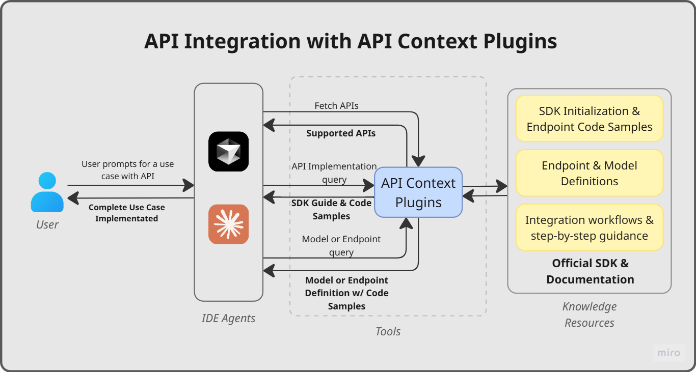
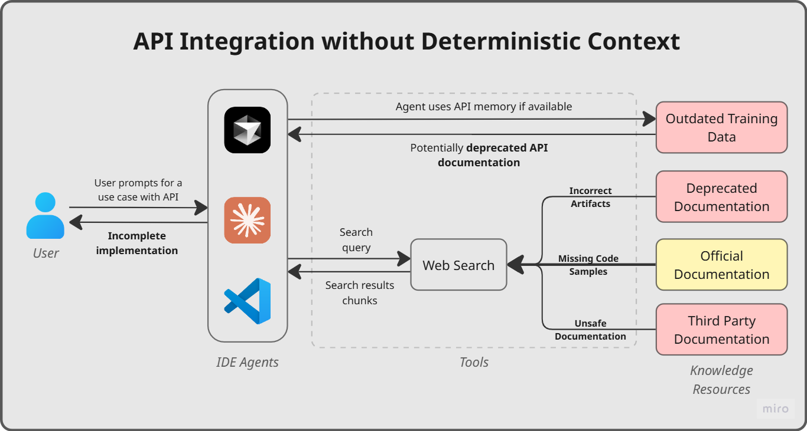

# APIMatic API Context Plugins

**SDK-native API context, delivered directly into your AI coding agent.**

[](https://www.apimatic.io/product/context-plugins)
[](https://www.apimatic.io/product/context-plugins)
[](https://www.apimatic.io/product/context-plugins)

---

## What is an API Context Plugin?




An API Context Plugin is a one-click MCP Server that delivers SDK-generated API context directly into AI-assisted IDEs like Cursor and Claude Code.

When a developer asks their agent to "integrate the payments API," it normally guesses — pulling from outdated training data or generic patterns that don't match the actual SDK. An API Context Plugin solves this by giving the agent authoritative, version-aware, SDK-native context at the exact moment it's needed.

---

## Try It Now

One-click install into your IDE:

| Cursor | Claude Code |
|--------|-------------|
| [Install](https://www.apimatic.io/product/context-plugins?ide=cursor) | [Install](https://www.apimatic.io/product/context-plugins?ide=claudeCode) |

---

## Supported APIs

The plugin gives the agent SDK-native context for the following APIs, available in TypeScript, C#, Python, Java, PHP, and Ruby:

| API | Description |
|-----|-------------|
| **Adyen API** | Payment processing: retrieve payment methods, create orders, manage stored payment tokens |
| **Google Maps APIs** | Location services: geocoding, directions, distance matrix, elevation, roads, and places |
| **PayPal Server SDK** | Payment flows: orders, payments, vault, transaction search, and subscriptions |
| **PayQuicker API** | Payment and financial services: program agreements, bank accounts, spendback quotes |
| **PostNL Ecommerce APIs** | Postal and logistics: delivery dates, barcodes, shipment status, parcel creation |
| **Slack API** | Workspace automation: OAuth bots, messaging, conversation management |
| **Spotify Web API** | Music and podcasts: library management, playback control, discovery |
| **Tesla Fleet Management API** | Vehicle and fleet operations: charging history, vehicle commands, energy management |
| **Tesser API Portal** | Digital payments: payment intents, onchain payments, app management |
| **Twilio API** | Communications: SMS, voice, video, and verification services |

---

## What the Plugin Gives the Agent

Once installed, the plugin exposes four tools to the agent. Each tool is mapped to a specific stage of the integration workflow:

| Tool | Developer task it enables |
|------|--------------------------|
| `fetch_api` | Lists all available APIs with their name, key, and description. The agent calls this first to discover which APIs are available for your project's language. |
| `ask` | Chat with API Copilot for step-by-step integration guidance and general API questions: authentication setup, client initialization, feature behavior, framework-specific patterns (e.g. "How do I initialize the Twilio client in Laravel?"), and idiomatic SDK code samples. |
| `endpoint_search` | Returns an SDK endpoint method's description, input parameters, and response shape by method name. |
| `model_search` | Returns an SDK model's full definition and its typed properties by name. Call this before writing code that constructs request bodies or reads response objects. |
---

## From Prompt to Code: How the Tools Work Together

The four tools are designed to chain together in a natural integration workflow. Here is a concrete example of what happens under the hood when the agent receives a real task:

**Your prompt:** _"Add Twilio SMS notifications to my Next.js app. Send a text when an order ships."_

| Step | Tool called | What it returns |
|------|-------------|----------------|
| 1 | `fetch_api` (`language=typescript`) | Discovers Twilio is available; returns its `key` |
| 2 | `ask` (`key=twilio`, query=_"How do I initialize the Twilio TypeScript client?"_) | Returns exact SDK setup code with auth configuration |
| 3 | `endpoint_search` (`query=createMessage`) | Returns the method signature, required parameters, and auth requirements for the SMS send endpoint |
| 4 | `model_search` (`query=CreateMessageRequest`) | Returns the full typed request model with every available field |
| 5 | `ask` (`query="How do I handle delivery status callbacks in Next.js?"`) | Returns webhook handling code aligned to the Twilio SDK |

Each step completes in a single tool call. The agent handles the orchestration. You describe the goal, and it picks the right tool at the right time.

---

## Example Prompts to Try

The best way to experience API Context Plugins is to paste these prompts directly into Cursor or Claude Code after installing a plugin. Each prompt is written to naturally trigger the full tool chain.

<details>
<summary><strong>Getting started with an API</strong></summary>

```
Set up the Spotify TypeScript SDK and fetch my top 5 tracks. Show me the complete client initialization and the API call.
```

```
How do I authenticate with the Twilio API and send an SMS? Give me the full PHP setup including the SDK client and the send call.
```

```
Walk me through initializing the Slack API client in a Python script and posting a message to a channel.
```

</details>

<details>
<summary><strong>Framework-specific integration</strong></summary>

```
I'm building a Next.js app. Integrate the Google Maps Places API to search for nearby restaurants and display them on a page. Use the TypeScript SDK.
```

```
I'm using Laravel. Show me how to send a Twilio SMS when a user registers. Include the PHP SDK setup, client initialization, and the controller code.
```

```
I have an ASP.NET Core app. Add Twilio webhook handling so I can receive delivery status callbacks when an SMS is sent.
```

</details>

<details>
<summary><strong>Chaining tools for full integrations</strong></summary>

These prompts are designed to exercise the full plugin workflow; from API discovery through endpoint lookup to production-ready code.

```
I want to add real-time order shipping notifications to my Next.js store. Use Twilio to send an SMS when the order status changes to "shipped". Show me the full integration: SDK setup, the correct endpoint and its parameters, and the TypeScript code.
```

```
I need to post a Slack message every time a Spotify track changes in my playlist monitoring app. Walk me through integrating both APIs in TypeScript — start by discovering what's available, then show me the auth setup and the exact API calls.
```

```
In my ASP.NET Core app, I want to geocode user addresses using Google Maps and cache the results. Look up the geocode endpoint and response model, then generate the C# code including error handling.
```

</details>

<details>
<summary><strong>Debugging and error handling</strong></summary>

```
My Spotify API call is returning 401. What OAuth flow should I be using and how does the TypeScript SDK handle token refresh automatically?
```

```
My Slack message posts are failing intermittently with rate limit errors. How does the Python SDK expose rate limit information and what's the recommended retry pattern?
```

</details>

---

## Build a Full App in Minutes

<details>
<summary><strong>PayPal Instant Storefront — Node.js/Express · 30 min</strong></summary>


**What was built:** A full Node.js/Express storefront with product management, shareable checkout links per product, PayPal Smart Payment Buttons, server-side order creation and capture, and a payment history dashboard.

**The prompt:**
```
Build a PayPal storefront. Product creation form, unique shareable checkout 
URL per product with Smart Payment Buttons, server-side order creation and 
capture, and a payment dashboard. Deployable with npm install && npm start.
```

<details>
<summary>Full prompt</summary>
  
```
Build me a "PayPal Instant Storefront" app. The app has a setup page where I 
enter my PayPal client-id and secret once, then a product creation form where 
I enter a product name, description, price, currency, and upload or provide 
product images. When I click "Generate Checkout Page" it creates a live, 
shareable checkout URL like /checkout/abc123 that anyone can open — they see 
the product details with images, price, description, and a working PayPal 
Smart Payment Button. The payment flow should be fully server-side using the 
PayPal Server SDK: backend creates the order when buyer clicks pay, captures 
it after approval, and shows a confirmation page with order details. I should 
be able to create multiple products and each gets its own unique checkout link 
I can share with anyone. Include a simple dashboard where I can see all my 
products and their checkout links, plus a list of completed payments showing 
order ID, buyer info, amount, and status for each product. The checkout pages 
should be mobile-responsive and look like real professional product pages. 
Support sandbox and live mode via environment variables. Only use the Orders 
API and Payments API, do not use Transaction Search or Vault. Make it 
deployable with npm install and npm start.
```

</details>

**How the tools were used:**

| Step | Tool | Query | What it returned |
|------|------|-------|-----------------|
| 1 | `fetch_api` | `language=typescript` | Available APIs; identified PayPal Server SDK with key `paypal` |
| 2 | `ask` | SDK setup & environment switching | Client initialization code, `.env` structure, sandbox vs. live config via `Client.fromEnvironment` |
| 3 | `ask` | Order creation flow | End-to-end create → approve → capture flow with full TypeScript server-side code |
| 4 | `endpoint_search` | `ordersCreate` | `CreateOrder` method signature, `OrderRequest` body structure, response type `Order`, error codes |
| 5 | `endpoint_search` | `capture` | `CaptureOrder` contract — required `id` param, optional body, capture ID location in response |
| 6 | `model_search` | `OrderRequest` | Full request model properties; flagged `payer` and `application_context` as deprecated |
| 7 | `model_search` | `Money` | Currency code and value fields for structuring amounts |
| 8 | `ask` | Smart Payment Buttons | Frontend button integration — `createOrder` / `onApprove` wiring to backend endpoints |
| 9 | `endpoint_search` | `getOrder` | `GetOrder` method signature and response shape for the confirmation page |
| 10 | `model_search` | `PurchaseUnitRequest` | Full model with `amount`, `items`, `shipping`, and all optional fields |
| 11 | `model_search` | `Order` | Full response model — `status`, `purchaseUnits`, `links` (including the `approve` redirect URL) |

**App outcome:**

- One-time credential setup page with live sandbox validation
- Product creation with name, description, price, currency, and image upload
- Unique shareable checkout URL per product (`/checkout/abc123`)
- Server-side order creation and capture — no client secrets exposed
- Confirmation page with order ID, buyer info, and capture details
- Dashboard with all products, total revenue, and payment history
- Mobile-responsive checkout pages
- Deployable with `npm install && npm start`

**Build time:** 10 min generation + 20 min testing = **30 minutes total**

</details>

## Why API Integration Breaks AI Coding Agents



API integration is not pattern generation — it is contract enforcement. SDKs encode strict models, auth flows, and version-specific behavior. Approximating any of it produces compile failures, runtime bugs, and security gaps.

Without authoritative SDK context, an agent falls back on two unreliable sources: training data that may not match the SDK version in use, and web search results that are often sanitized — code samples stripped of critical detail or reconstructed from incomplete examples. Neither reflects the actual SDK contract. The result is mixed patterns, misinterpreted auth flows, and speculative code that requires repeated correction.

| Approach | Complete Integration | Problem |
|----------|---|---------|
| LLMs.txt | ❌ | Static docs — no SDK-native patterns, no idiomatic code |
| AI without context | ❌ | Trained on historical data — may generate outdated or incorrect integration code |
| **API Context Plugin** | ✅ | SDK-generated, version-aware context grounded in the actual SDK |

---

## Measured Results

Four experiments on PayPal API integration and migration tasks across two production-grade .NET applications ([nopCommerce](https://github.com/nopSolutions/nopCommerce) and [eShop](https://github.com/dotnet/eshop)), run on Cursor with GPT-4.1 High. Same task, same IDE, same model — once with agent-only (web search), once with API Context Plugins.

| Metric | Agent only | Agent + API Context Plugins | Change |
|--------|-----------|------------------------|--------|
| Compile / runtime errors | 16 | 1 | ↓ 91% |
| Prompt iterations | 34 | 16 | ↓ 54% |
| Token consumption | ~57M | ~20M | ↓ 65% |
| Manual fixes | 11 | 0 | ↓ 100% |
| Hallucinations | Multiple per run | 0 | ↓ ~Zero |

**Token consumption without API Context Plugins can skyrocket.** In the most complex experiment (new PayPal checkout integration in eShop), the agent consumed **130.9M tokens** without API Context Plugins — compared to **40M with API Context Plugins**. The agent spent the bulk of those tokens searching the web, reconciling conflicting results, and correcting its own mistakes.

Code quality scores (rated 1–5 across architecture, modularity, design patterns, error handling, and readability) improved from an average of **~3.0 to ~4.8** across all dimensions.

→ [Read the full case study](https://www.apimatic.io/product/context-plugins/case-study)

---

## How APIMatic Generates an API Context Plugin

APIMatic takes your OpenAPI specification through the same SDK generation pipeline it uses to produce idiomatic, type-safe SDKs in 10+ languages. The resulting MCP server exposes the SDK documentation and integration patterns as structured tool responses that AI assistants can consume natively.

This means the context the AI receives is:
- Derived from actual generated SDK code, not raw documentation
- Inclusive of idiomatic patterns, typed models, and error handling
- Aligned to the current version of your API spec

For API providers: [request a demo](https://www.apimatic.io/request-demo) to generate an API Context Plugin for your own API.

---

## Repository Structure

```
ContextPlugins/
├── .claude-plugin/     # Claude Code plugin configuration (mcp.json, plugin.json)
├── .cursor-plugin/     # Cursor plugin configuration (mcp.json, plugin.json)
├── .github/
│   └── ISSUE_TEMPLATE/ # Issue templates for API, language, and feature requests
├── assets/             # Logos and static assets
├── skills/
│   └── integrate-api-context-plugins/  # AI agent skill for plugin integration guidance
├── CLAUDE.md           # Claude Code agent instructions
├── LICENSE.txt
└── README.md
```

---

## Contributing

Have a request or found an issue? Use one of the templates below:

- [Request a new language](../../issues/new?template=language-request.yml) — ask for support for a new SDK language (e.g., Swift, Kotlin, Rust)
- [Request a new API](../../issues/new?template=api-request.yml) — ask for a new third-party API to be added to the catalog
- [Request a tool or feature](../../issues/new?template=feature-request.yml) — suggest a new MCP tool or an improvement to an existing one

For anything else, [open a blank issue](../../issues/new) or reach out at [support@apimatic.io](mailto:support@apimatic.io).

---

## Learn More

- [Product page](https://www.apimatic.io/product/context-plugins)
- [Blog: From API Portals to Cursor](https://www.apimatic.io/blog/from-api-portals-to-cursor)
- [Case Study](https://www.apimatic.io/product/context-plugins/case-study)
