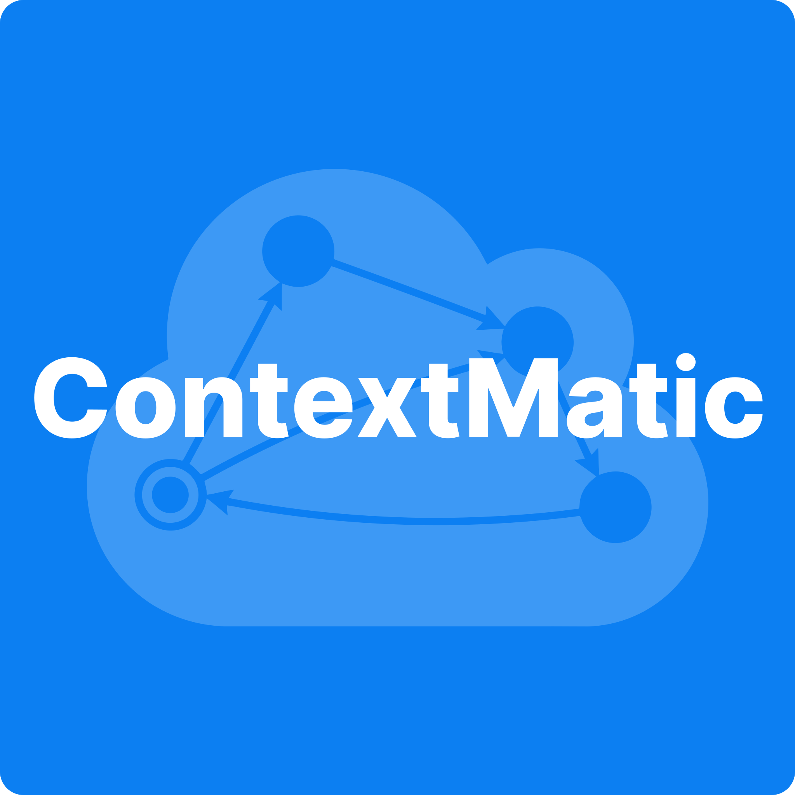

# API Context Plugins



General-purpose AI models are trained on public code and documentation, much of it outdated. They have no awareness of the actual API version, latest SDKs, or recommended workflows.

**API Context Plugins** give coding assistants deterministic, version-aware API context — generated directly from your API definition and SDKs. Instead of scraping public documentation or guessing from memory, the AI is grounded in the exact OpenAPI definition, current SDK versions, executable idiomatic code samples, and recommended integration workflows.

## Requirements

- No API key required — the MCP server is publicly accessible

## Installation

### Claude Code

Clone this repository and start Claude Code with the plugin directory. The MCP server and skill are configured automatically:

```bash
git clone https://github.com/apimatic/api-context-plugins.git
claude --plugin-dir ./api-context-plugins
```

Or configure manually:

1. Add the MCP server to your Claude Code MCP config:

```json
{
  "mcpServers": {
    "api-context-plugins": {
      "url": "https://chatbotapi.apimatic.io/mcp/plugins"
    }
  }
}
```

2. Copy the skill into your project's `.claude/` directory:

```bash
cp skills/integrate-api-context-plugins/SKILL.md <your-project>/.claude/
```

### Cursor

Install from the [Cursor Marketplace](https://cursor.com/marketplace). The MCP server and skill are configured automatically.

Or configure manually:

1. Add the MCP server via **Settings → MCP**:

```json
{
  "mcpServers": {
    "api-context-plugins": {
      "url": "https://chatbotapi.apimatic.io/mcp/plugins"
    }
  }
}
```

2. Copy the skill into your project's `.cursor/` directory:

```bash
cp skills/integrate-api-context-plugins/SKILL.md <your-project>/.cursor/
```

## Usage

Once installed, describe what you want to build and the plugin activates automatically:

- _"Integrate Paypal payments into my checkout flow"_
- _"Set up Twilio SMS notifications in my Python service"_

## MCP Tools

| Tool | Description |
|---|---|
| `fetch_api` | Fetch all available APIs with their names and descriptions. Always start here. |
| `ask` | Ask a question about a specific API to get integration steps and code samples. |
| `model_search` | Look up an SDK model's definition and properties by name. |
| `endpoint_search` | Look up an SDK endpoint method's description, parameters, and response by name. |

## Supported Languages

`typescript` · `python` · `csharp` · `java` · `go` · `ruby` · `php`

The language is inferred automatically from your project's files (e.g. `.csproj` → `csharp`, `package.json` + TypeScript → `typescript`).

## Plugin Contents

| Path | Purpose |
|---|---|
| `.claude-plugin/plugin.json` | Claude Code plugin manifest |
| `.claude-plugin/mcp.json` | Claude Code MCP configuration |
| `.cursor-plugin/plugin.json` | Cursor plugin manifest |
| `.cursor-plugin/mcp.json` | Cursor MCP configuration |
| `skills/integrate-api-context-plugins/SKILL.md` | API integration skill |
| `.mcp.json` | MCP configuration (auto-discovery fallback) |
| `assets/logo.svg` | Plugin logo |
